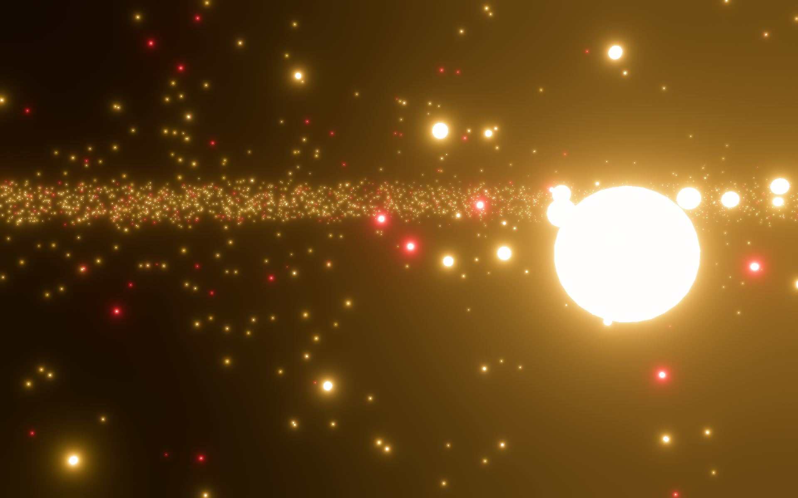
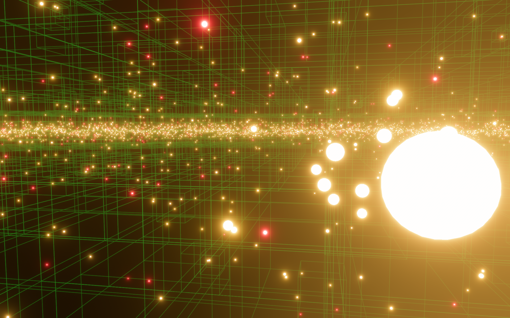

# Evolutionary N-Body Accretion Disk Simulation

A high-performance 3D N-Body physics engine and evolutionary simulation built in Rust using the Bevy Entity-Component-System (ECS).

This project simulates the gravitational interactions and collisions of tens of thousands of bodies to model the formation of protoplanetary accretion disks. To bypass manual parameter tuning, the project integrates a Genetic Algorithm (GA) that autonomously evolves the initial spawning conditions (mass distribution, orbital spin, velocity variance, and spatial range) to generate stable, Keplerian orbital systems.

## Visual Showcase


*Figure 2: Evolutionary output demonstrating a stable central protostar and an orbiting protoplanetary debris ring with HDR bloom and tonemapping.*


*Figure 1: Real-time visualization of the Barnes-Hut Octree structure dynamically dividing spatial volumes based on mass density.*

## Key Features

- **Barnes-Hut Octree Gravity:** Reduces the gravitational computational complexity from $O(N^2)$ to $O(N \log N)$.
- **Spatial Hash Grid Collisions:** Implements a flat-array spatial hash grid coupled with a Union-Find (Disjoint Set) algorithm for $O(N)$ collision detection and momentum-conserving mass accretion.
- **Genetic Algorithm (Headless Training):** Evaluates universes based on a dimensionless multiplicative fitness function (survival rate, orbital circularity, mass concentration, and spatial containment) over thousands of ticks natively without rendering overhead.
- **Parallel Processing:** Leverages `Rayon` for multi-threaded physics integration and `mimalloc` for optimized memory allocation.
- **Real-time Diagnostic Visualization:** Features an in-engine interactive camera and a real-time debug visualization of the Octree spatial partitioning.

## Controls (Visual Showcase Mode)

When running the simulation normally (without the training flag), you can navigate the 3D space and control the flow of time:

- **`Right Click (Hold)` + `Mouse`:** Look around (Mouse Look)
- **`W` / `A` / `S` / `D`:** Fly forward / left / backwards / right
- **`Space` / `Left Shift`:** Fly up / down
- **`Left Ctrl (Hold)`:** Increase flight speed
- **`Right Arrow` / `Left Arrow`:** Increase / Decrease simulation speed (Time step multiplier)
- **`P`:** Pause / Resume physics simulation
- **`O`:** Toggle Octree spatial partitioning visualization (Gizmos)

## Usage & Execution

### Native Rust Execution

**Visual Showcase Mode:** Runs the simulation using the best genome found (`best_genome.json`).
```bash
cargo run --release
```

**Headless Training Mode:** Runs the Genetic Algorithm without rendering to heavily optimize epoch evaluation times.
```bash
cargo run --release -- --train
```

### WSL Requirements For Cross-Compilation to Windows

If you are developing on WSL and need to cross-compile for Windows natively:

**Install cross-compilation tools:**
```bash
cargo install cargo-alias-exec cargo-xwin
rustup target add x86_64-pc-windows-msvc
```

Install linker and compiler dependencies. You must install `lld` and `llvm`. A C compiler is also required; `clang` is highly advised.

### WSL Build Commands

The project includes custom aliases for streamlined cross-compilation:

- **`cargo xwinb`:** Dev build for Windows.
- **`cargo xrun`:** Dev build & run for Windows (Executes the compiled `.exe` directly).
- **`cargo xrel`:** Release build for Windows.
